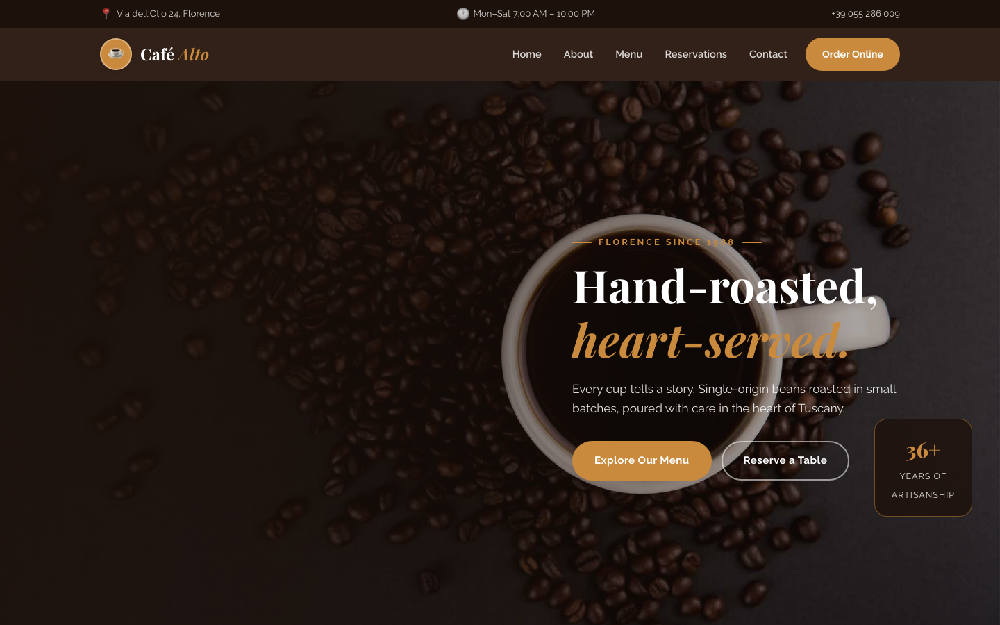

# Café Alto — Artisan Coffee House Template

A premium, framework-free HTML template for an artisanal coffee house. Deep espresso grounds with warm caramel and cream accents, driven by Playfair Display display type and Raleway body text — a rich, editorial presence for a family roastery in the heart of Florence.

## 📸 Screenshot

## Design System

| Token | Value |
|-------|-------|
| **Ground** | `--clr-espresso` `#2b1a12` (roast), `--clr-cream` `#faf5ec` |
| **Primary** | `--clr-caramel` `#c98a3d` (toast), `--clr-caramel-deep` `#a96f2c` |
| **Secondary** | `--clr-mocha` `#6b4a36` |
| **Surface** | `--clr-card` `#ffffff`, `--clr-latte` `#f3ecdf`, `--clr-sand` `#ede3d2`, `--clr-line` `#e5d8c6` |
| **Text** | `--clr-ink` `#241812`, `--clr-text` `#6b5546`, `--clr-muted` `#96826f` |
| **Display type** | `Playfair Display` (400–800) |
| **Body type** | `Raleway` (400–800) |
| **Container** | 1200px max-width, centered |
| **Radius** | 18px |
| **Breakpoints** | ~992px, ~768px, ~576px |

## Pages

| Page | File | Description |
|------|------|-------------|
| Home | [index.html](index.html) | Crossfading hero, values ribbon, story split, service cards, signature drinks, reservation form, testimonials, journal, CTA |
| About | [about.html](about.html) | Family story since 1988, check-list craft, stats band, three values |
| Menu | [menu.html](menu.html) | Hot coffee, cold coffee and pastry sections with prices and tasting notes |
| Reservations | [reservation.html](reservation.html) | `[data-form]` booking form, private events, jazz nights |
| Contact | [contact.html](contact.html) | Info list, subject-select contact form, embedded map |
| 404 | [404.html](404.html) | On-brand error page with recovery links |

## Features

- **Framework-free** — pure HTML5, CSS3 (custom properties, Grid, Flexbox, `clamp()`), vanilla JavaScript
- **Roastery editorial aesthetic** — espresso + caramel + cream, Playfair Display headlines
- **Fluid responsive** — three breakpoints, no horizontal scroll on any viewport
- **Scroll reveal** — IntersectionObserver-powered `.reveal` animations (respects `prefers-reduced-motion`)
- **Mobile nav** — burger toggle with `aria-expanded` accessible pattern
- **Hero crossfade** — automatic 6s background image transition via `.hero-bg img` + `.active`
- **Ribbon strip** — six-item craft highlights under the hero
- **Story split** — photo with floating badge, check-list and CTA
- **Service cards** — circular photography, name and description
- **Menu cards** — image, tag, transparent price, tasting notes
- **Reservation form** — date, time, guest select, occasion and requests, `[data-form]` hook
- **Testimonial cards** — avatar, name, role and quote
- **Journal cards** — tag, title, excerpt and link
- **Contact form** — subject select with validation feedback
- **Newsletter** — footer sign-up form with validation feedback
- **Original imagery** — Florence roastery, coffee and pastry photography, no placeholders

## Tech Stack

- HTML5 + CSS3 (W3C-valid, semantic landmarks)
- Vanilla JavaScript (canonical IIFE build)
- Google Fonts (Playfair Display + Raleway)
- SVG favicon (inline data: URI)
- OpenStreetMap embed (contact page)

## SEO

- Semantic HTML5 structure (`<header>`, `<nav>`, `<main>`, `<section>`, `<footer>`)
- Unique `<title>` and `<meta description>` per page
- `lang="en"` attribute, `charset="utf-8"`, viewport meta
- Alt text on all images

## License

Free for personal and commercial use. Attribution appreciated but not required.

---

## Let's Build Something Together 🚀

[Book a free consultation](https://tally.so/r/q4q1L9)
